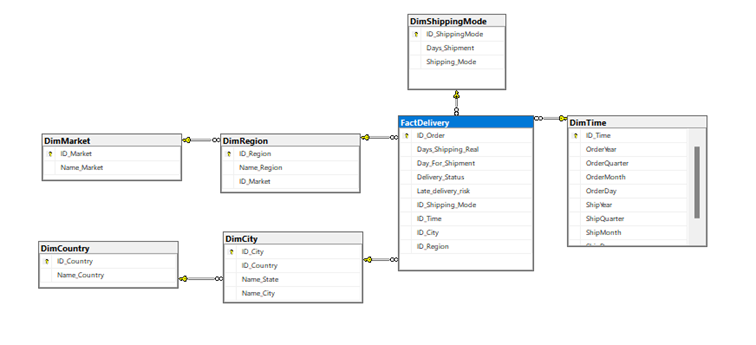
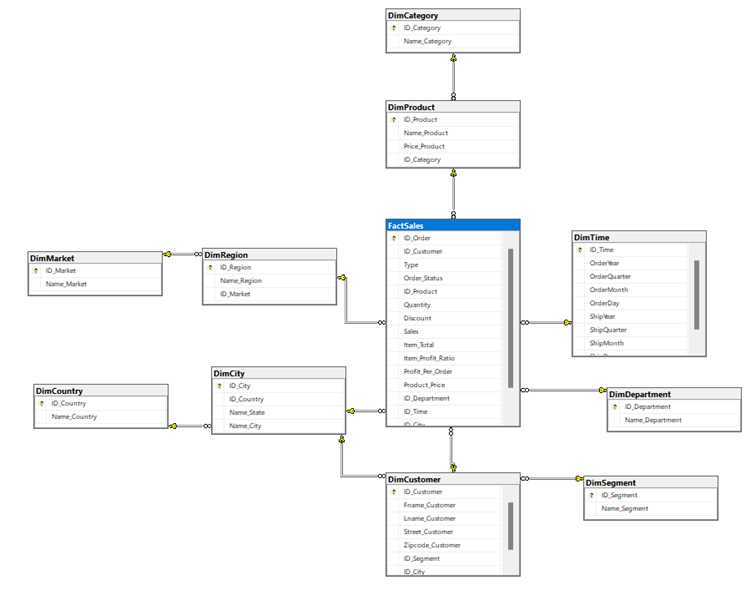
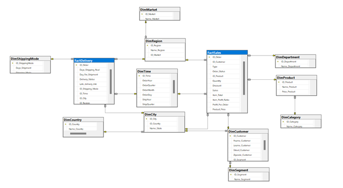
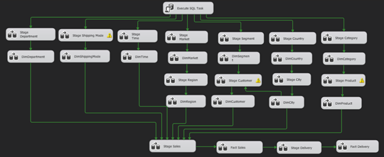
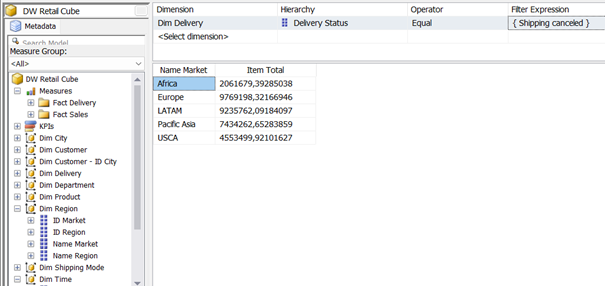
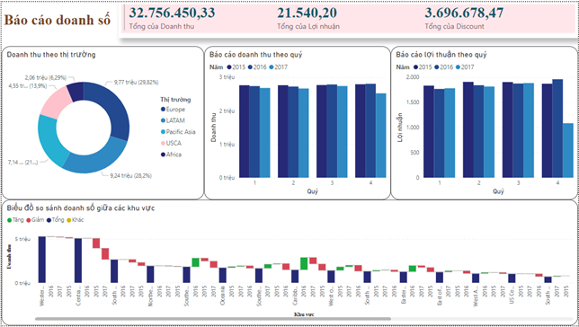
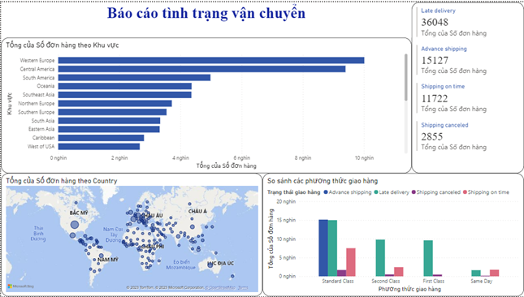
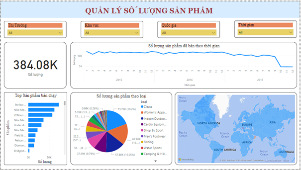

# Building-a-data-warehouse-for-the-retail-industry
Dự án xây dựng kho dữ liệu dự trên một tập dữ liệu về của một cửa hàng bán lẻ

### 1. Xác định business process
- Dựa vào tập dữ liệu thì chúng ta cần đưa ra các báo cáo về doanh số tổng quan 
của cũng như chi tiết của từng sản phẩm dựa theo từng thuộc tính khác nhau trong tập 
dữ liệu và đưa ra các nhận xét về cách vận hành của các phương thức vận chuyển từ đó 
cải thiện hiệu quả. Ngoài ra, còn có thể so sánh hiệu quả bán hàng của các đất nước và 
khu vực khác nhau.
- Từ các yêu cầu đó thì kho dữ liệu sẽ có:
  - Hai bảng Fact gồm FactSales và FactDelivery cả hai đều thuộc loại Transactions. Business process của mỗi bản Fact:
    - FactSales: Dùng để phân tích và báo cáo doanh số, lợi nhuận và số lượng bán ra của từng sản phẩm theo từng thuộc tính.
    - FactDelivery: Báo cáo về hoạt động của việc vận chuyển đơn hàng đến cho người dùng
  - Các bảng Dim gồm có: DimDepartment, DimShippingMode, DimTime, DimMarket, DimRegion, DimSegment, DimCustomer, DimCountry, DimCity, DimCategory, DimProduct. Dùng để cung cấp thông tin cho bảng Fact.
### 2. Lược đồ 
- Snowflake Schema
<picture>
  
</picture>
<picture>
  
</picture>

- Constellation Schema
<picture>
   
</picture>

### 3. Xây dựng ETL pipeline bằng SSIS
Dữ liệu sẽ được sử lý và đổ vào cơ sở dữ liệu Stage trước sau khi hoàn tất thì sẽ đổ vào kho dữ liệu
<picture>
  
</picture>

### 4. Xử dụng SSIS để phân tích
Đưa ra các câu hỏi và dùng SSIS để trả lời
- Ví dụ: Thị trường nào có doanh thu nhiều nhất và thị trường nào có doanh thu ít nhất?
<picture>
  
</picture>

### 5. Tạo dashboard bằng Power BI
-	Báo cáo doanh thu
<picture>
  
</picture>

-	Báo cáo tình trạng vận chuyển hàng
<picture>
  
</picture>

-	Báo cáo số lượng hàng hoá bán ra theo thời gian, khu vực và thị trường và theo loại sản phẩm.
<picture>
  
</picture>
